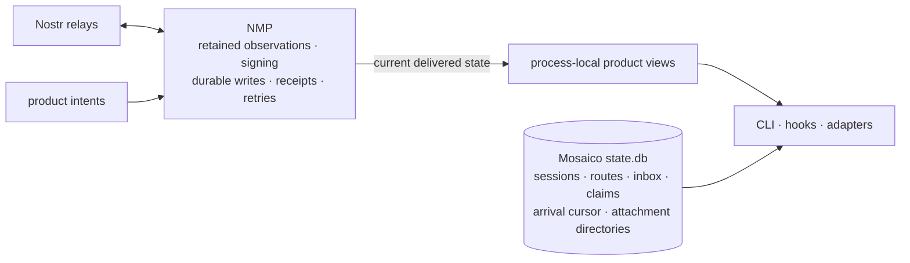

# mosaico — Fabric Architecture (overview)

> The one-page version. For the full ownership and provider boundaries, see
> [`fabric-architecture.md`](./fabric-architecture.md).

## The one idea

**NMP owns relay state. Mosaico owns product-local continuity.**

NMP retained observations are the sole authority for current groups, profiles,
statuses, events, messages, recipients, and reactions. Mosaico may adapt an
observation into a process-local product view, but it does not copy that state
into SQLite, choose replacement winners, invent freshness, or preserve a row
after NMP removes it.

Readers combine two explicitly different sources:

| Source | Owns | Lifetime |
|---|---|---|
| NMP retained observations | Relay-derived groups, profiles, statuses, events, messages, recipients, and reactions | Present only while delivered by the active observation; removal or observation loss removes the view |
| Mosaico `state.db` | Sessions, routes and join fences, inbox and delivery claims, signer/locator authority, local operational ledgers, event-arrival order, and downloaded attachment directories | Durable across daemon restart until product policy changes it |

The distinction is part of every read contract. A missing NMP value cannot be
filled from a stale Mosaico cache, and a host-local route or inbox claim must not
be presented as relay membership or delivery evidence.

## Reads and intents

- **Reads** use the current NMP observation for shared relay facts and the local
  store for host-owned continuity. Public DTOs may join those sources, but must
  preserve their meaning.
- **Intents** ask the active provider to create a group, change membership,
  publish chat, or publish status. NMP owns signing, routing, custody, retries,
  and terminal receipts.
- **Observation is the state transition.** Publish acceptance means NMP accepted
  responsibility for the write. It does not create a message, recipient,
  membership, inbox item, or route. Those effects begin only when the event is
  delivered by the relevant NMP observation.

## The membership hinge

For NIP-29, the relay enforces writes and NMP's current group observation is the
membership authority. Mosaico's `session_channels` and `session_standing` rows
record local routing and reconciliation obligations only. They may survive a
restart, but they never prove that a pubkey is currently admitted by the relay.

A direct observed message explicitly p-tagging a daemon-owned pubkey may create
a durable inbox row for that local identity. Runtime availability then selects
an executor. Publish acceptance alone and remote p-tags create no local inbox
work.

## Restart behavior

Restart reopens `state.db`, preserving local route fences, inbox/claim state,
and attachment-directory paths. Relay-derived views start from no local copy and
repopulate only as NMP delivers the active observations. This makes absence and
retraction honest: if NMP no longer delivers a relay fact, Mosaico no longer
shows it.

## Boundary to preserve

Provider-specific encoding and lifecycle reactions stay behind the provider.
NMP owns protocol truth and transport guarantees. Mosaico owns product policy,
local execution, and local durability. Neither side reimplements the other's
state machine.
