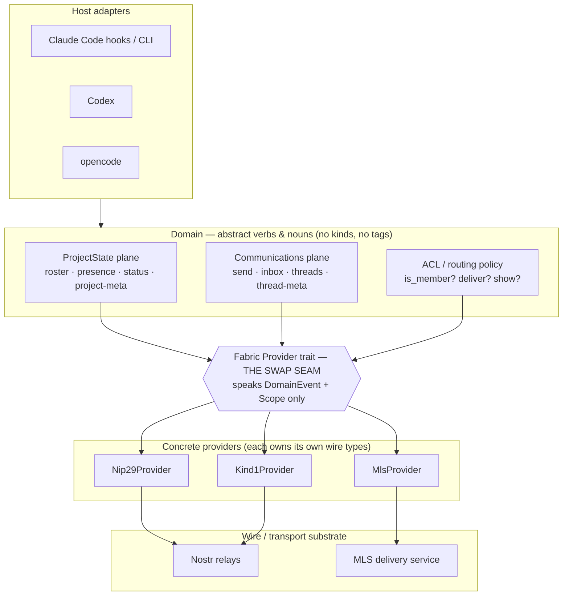
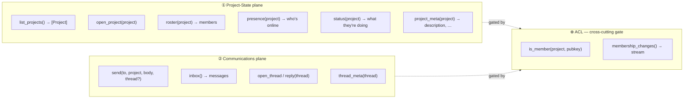
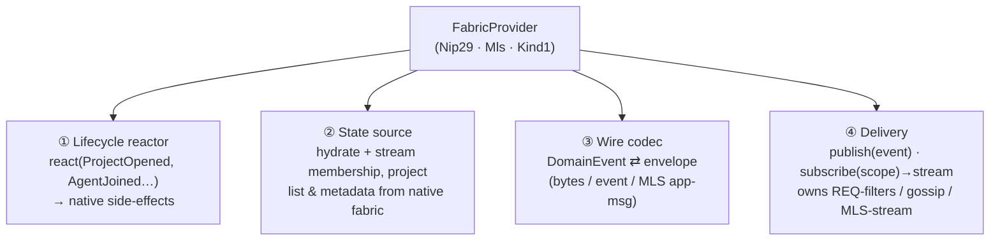
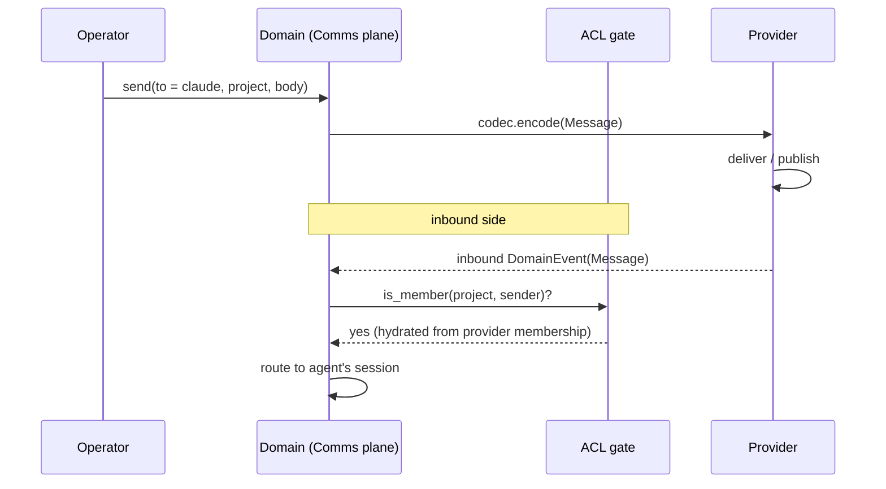

# tenex-edge — Fabric Architecture (proposal)

> High-level architecture for the swap-seam. Goal: the domain speaks in abstract
> **verbs** about *project state* and *communications*; a single **Fabric
> Provider** (nip29 / mls / kind1) owns *all* of how-and-who — wire shape,
> membership/ACL, and the side-effects of lifecycle events. Nothing above the
> provider seam ever names a kind, a tag, a group, or a relay.

---

## 1. The core problem

The current `Codec` seam swaps *NIP layouts*, not *fabrics*. It traffics in
`nostr_sdk` types and fuses three unrelated concerns into one trait:

- **wire mapping** (domain event ↔ envelope),
- **subscription model** (`filters → Vec<Filter>`, relay-REQ-shaped),
- **access control** (NIP-29 group create / lock / put-user, bolted into `kind1`).

That fusion is why "a new codec" can only ever be another nostr codec, and why
NIP-29 — an *ACL strategy* — leaks into an *event codec*. The fix is to cut the
seam along **concerns**, not along **kinds**.

Two observations drive the whole design:

1. **Membership is the hinge.** Whether to show a peer's presence or deliver a
   mention to an agent is one decision — *"is this pubkey a member?"* — but its
   **source** differs per fabric:

   | Fabric | "member" means | hydrated from |
   |--------|----------------|---------------|
   | nip29  | in the NIP-29 group | live `39002` members list (kept subscribed) |
   | mls    | in the MLS group | MLS group roster after invite/accept |
   | kind1  | locally accepted | whitelist file of known/accepted pubkeys |

   The **shape** is uniform (`is_member(project, pubkey)` + a change stream); the
   **source** is the provider's secret. Add a member from another machine → the
   nip29 provider's live subscription reflects it; nothing above notices *how*.

   The **enforcement locus** also differs — and this is what forces the ACL to be
   a domain-side gate rather than something we delegate to the fabric:

   | Fabric | membership enforced | by whom |
   |--------|---------------------|---------|
   | nip29  | server-side — relay rejects non-member writes (closed group) | the relay |
   | mls    | cryptographically — non-members cannot decrypt | the crypto |
   | kind1  | client-side — we filter inbound against the local whitelist | us |

   **Principle:** the domain `is_member` gate is *always* consulted client-side;
   server/crypto enforcement is defense-in-depth, never a replacement. kind1 has
   no server enforcement at all, and even nip29 has un-scoped inbound paths (a
   direct p-tagged note reaches us via the `mentions_to` filter without the relay
   ever checking group membership). So the gate can never be skipped — which is
   exactly why it lives in the domain, above the provider seam.

2. **Lifecycle events have provider-specific side-effects.** "I run claude-code
   in a never-seen directory" is one domain event — `ProjectOpened` — that each
   provider *reacts* to differently:

   | Fabric | reaction to `ProjectOpened` |
   |--------|-----------------------------|
   | nip29  | create group `9007` → lock closed `9002` → put agent member `9000` |
   | mls    | create MLS group → invite agent key → await accept |
   | kind1  | **no-op** — a "group" is just a `t`/`h` tag on each event |

---

## 2. Layer cake



**Rule of the seam:** everything *above* `SEAM` is written once and never edited
to add a fabric. Everything *below* is a self-contained provider. The domain's
vocabulary is `DomainEvent` + `Scope` (today's `SubScope`) — the two types that
are already genuinely transport-agnostic.

---

## 3. The verbs — two planes, one ACL

The domain exposes **intents**, grouped by concern. These are what host adapters
and the daemon call; they say *what*, never *how*.



- **Project-State plane** answers *"which projects exist, who is here, who is
  online, what are they doing, what is this project."* Enumeration (`list_projects`),
  roster (membership), presence (live sessions), status/activity (work narrative),
  metadata (description, …).
- **Communications plane** answers *"who said what to whom, in which thread."*
  Directed messages, inbox delivery, thread organization + metadata.
- **ACL** is *not* a third plane — it's the predicate both planes consult.
  Presence is shown only for members; a mention is routed to an agent only if the
  sender is a member. One policy, one place, fed by the provider.

> **Roster and ACL are one source, viewed two ways.** `roster(project)` (project-
> state plane) and `is_member` / `membership_changes` (the gate) are not two
> sources of truth — they are the *queryable list* and the *routing predicate*
> over the single membership stream the provider hydrates. The list is for "show
> me who's here"; the predicate is for "should this event be shown/routed."

### 3a. Project enumeration & metadata — the provenance axis

`list_projects()` and `project_meta()` follow the **same pattern as membership**:
a uniform domain shape (`Project { slug, description, picture, … }`), a
provider-owned source, exposed as **queryable + streamable**. And just as
membership had an *enforcement-locus* axis, project metadata has a **provenance /
authority** axis — *where the description comes from, and whether it is shared
truth* — which differs per fabric:

| Fabric | project *list* source | *description* source | authority / consistency |
|--------|----------------------|----------------------|-------------------------|
| nip29  | groups the agent belongs to (reverse of `39002`) / relay group enumeration | relay-authored `kind:39000` group metadata | **canonical & shared** — one source, every machine agrees |
| mls    | MLS groups in local state | group-context extension / metadata message | **member-authored**, cryptographically scoped to the group |
| kind1  | *derived* — observed `h`/`t` tags + local list of dirs run in | **none native** → local descriptor file or a self-published note | **client-local** — two machines may disagree; eventually-divergent |

The sharp edge is **kind1**: a "group" is just a tag, so there is no native
carrier for a description and no authoritative project registry. Two consequences
the domain must absorb:

- **The list is *derived*, not *enumerated*.** For kind1, `list_projects()` is
  reconstructed from observed events (which `h`/`t` tags have we seen?) plus a
  local record of directories opened — never a server-side directory listing.
- **Description is `Option`, and may be local-only.** The domain types
  `description: Option<String>` and tolerate per-machine divergence. This is the
  exact analogue of kind1's client-side membership enforcement: not a flaw in the
  abstraction, but the abstraction faithfully surfacing that the fabric has no
  shared truth here.

**Retrieval mode is provider-owned too** — "different ways to retrieve" cuts along
a second axis, *pull vs. live*. nip29/mls can one-shot **fetch** the `39000`
metadata *or* **subscribe** to it (it's replaceable), so a description edited on
another machine propagates with zero domain changes — the same live-membership
trick. kind1 uses whatever local mechanism applies (file watch, or re-derive from
the event stream). So `project_meta` is, like roster, a `(query_once,
subscribe_changes)` pair the provider hydrates — and `list_projects` likewise has
a streaming sibling for "a new project appeared on the fabric."

---

## 4. The Fabric Provider seam (SRP decomposition)

A `Provider` is **one cohesive object per fabric** that bundles four
single-responsibility capabilities. Splitting them keeps each concern testable
and prevents the current "codec also does ACL" fusion.



| # | Capability | Responsibility | Must **not** |
|---|------------|----------------|--------------|
| ① | **Lifecycle** | Turn a domain lifecycle event into provider-native setup (create group, invite, or no-op). | Decide *when* a project opens (that's the host/daemon). |
| ② | **State source** | Be the single source for the fabric's read-state — membership/roster, the project list, and project metadata — each hydrated from its native mechanism (or *derived*, for kind1) and offered as a `(query, stream)` pair. | Decide routing policy (that's the domain ACL gate). |
| ③ | **Wire codec** | Pure, symmetric ser/de of the five+ `DomainEvent` nouns to its envelope. | Open subscriptions or manage groups. |
| ④ | **Delivery** | Connect/auth, publish a domain event, and stream inbound domain events for a `Scope`. Owns whatever fetch model the fabric uses. | Know domain meaning beyond the codec it delegates to. |

The runtime only ever holds a `Box<dyn FabricProvider>`. Swapping fabric = swap
the constructor. The `filters`-shaped subscription model disappears from the
public seam — it becomes a private detail of the nostr delivery impl, so a
push/gossip/MLS delivery model is now expressible.

---

## 5. Walkthrough — "a brand-new project spins up"

Same domain trigger, three provider reactions. The host adapter emits
`ProjectOpened(dir)`; everything downstream is provider-private.

```mermaid
sequenceDiagram
    participant CC as Claude Code (host)
    participant DOM as Domain / daemon
    participant P as Active Provider
    participant FAB as Fabric

    CC->>DOM: ProjectOpened(new dir)
    DOM->>P: lifecycle.react(ProjectOpened)

    alt nip29 provider
        P->>FAB: create group 9007 (h = dir slug)
        P->>FAB: edit-metadata 9002 (closed + public)
        P->>FAB: put-user 9000 (agent = member)
        %% subscribe 39002 members keeps the ACL live
        P->>FAB: subscribe 39002 members
    else mls provider
        P->>FAB: create MLS group
        P->>FAB: invite agent key
        FAB-->>P: agent accepts → roster updated
    else kind1 provider
        P-->>P: no-op (group == t/h tag; nothing to create)
    end

    DOM->>P: membership.stream(project)
    P-->>DOM: roster updates (uniform shape)
```

Then a human messages the agent:



The routing decision (`is_member?`) is identical Rust for all three fabrics; only
the **source** of the answer differs — and that source is owned entirely by the
provider's membership capability. Add a pubkey as a member from another computer
→ the nip29 provider's live `39002` subscription updates the ACL → the next
inbound message from that pubkey routes, with zero domain changes.

---

## 6. What moves where (migration sketch)

| Today | Proposed home |
|-------|---------------|
| `Codec::encode/decode` | **Wire codec** capability (③) — unchanged in spirit |
| `Codec::filters` | **Delivery** capability (④), private — no longer on the seam |
| `kind1::group_create / lock / put_user` | **nip29 Lifecycle** reactor (①) |
| `kind1::filters` 39000/39001/39002 block | **nip29 Membership** source (②) |
| whitelist / ACL file logic | **kind1 Membership** source (②) |
| `Transport` (nostr-sdk plumbing) | shared substrate behind nostr providers' Delivery |
| `DomainEvent`, `SubScope` | unchanged — they *are* the seam vocabulary |

Nothing in `domain.rs` changes. `SubScope` is renamed conceptually to `Scope`
and may grow a `thread` field as the Communications plane formalizes threading.

---

## 7. Open questions (deliberately unresolved)

- **Threading** is named as a Communications-plane concern but not yet a domain
  noun. nip29 has no native thread; mls has none; both would model threads as
  reply-tags. Does `Thread` become a first-class `DomainEvent`, or a derived
  view over `Message` reply-edges?
- **Identity binding** (agent keypair ↔ fabric identity) is assumed shared, but
  MLS adds a key-package / accept handshake with no nostr analogue. Is that a
  fifth provider capability, or part of Lifecycle?
- **Multi-fabric at once** — can a daemon run nip29 *and* kind1 providers
  concurrently (one project per fabric), and does the ACL gate merge their
  rosters or keep them partitioned per project?
