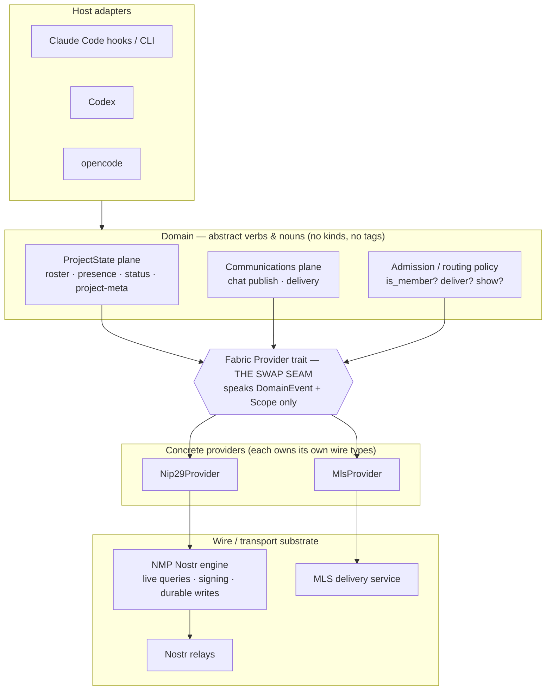
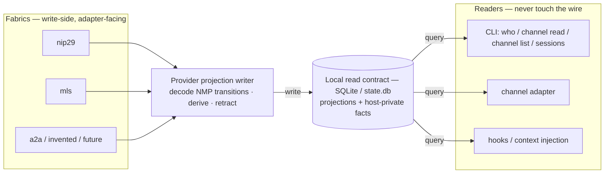
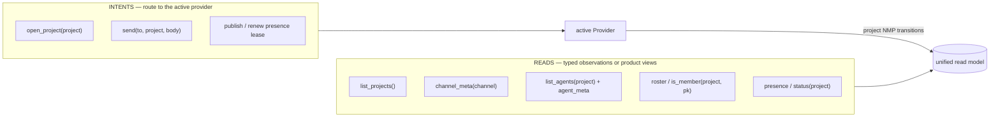
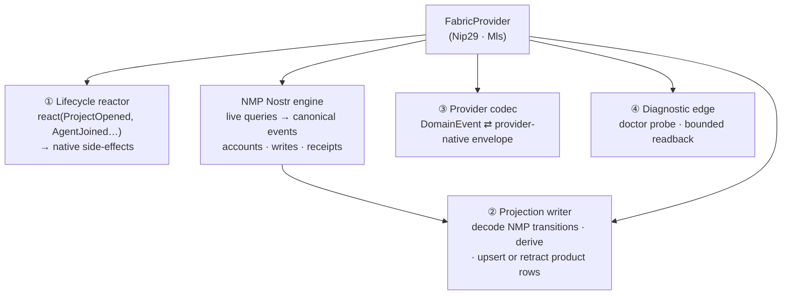
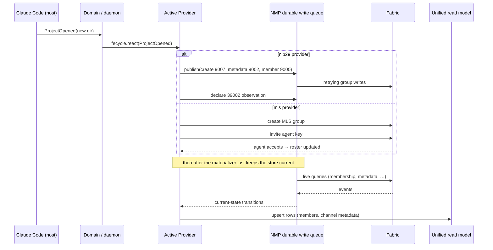
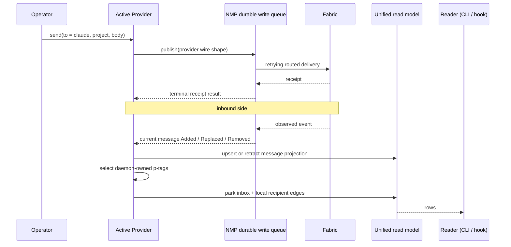

# mosaico — Fabric Architecture

> High-level architecture for the swap-seam: product reads use one local contract,
> while every shared fact retains enough provenance and evidence to say what was
> actually observed. A **Fabric Provider** translates NMP-delivered transitions into
> disposable product projections. NMP is the sole Nostr authority: acquisition,
> current-event selection, retraction, signing, routing, receipts, retries, and its
> durable publish queue. The direct `nostr` dependency supplies protocol values and builders only.

---

## 1. The core problem

The former `Codec` seam swapped *NIP layouts*, not *fabrics*. It trafficked in
Nostr wire types and fused three unrelated concerns into one trait:

- **wire mapping** (domain event ↔ envelope),
- **subscription model** (`filters → Vec<Filter>`, relay-REQ-shaped),
- **admission control** (NIP-29 group create / lock / put-user, bolted into the wire codec).

That fusion is why "a new codec" can only ever be another nostr codec, and why
NIP-29 — an *admission strategy* — leaks into an *event codec*. The fix is to cut the
seam along **concerns**, not along **kinds**.

Two observations drive the whole design:

1. **Membership governs ambient visibility and writes.** Whether to show a
   peer's presence or accept a channel write depends on membership, whose
   **source** differs per fabric:

   | Fabric | "member" means | hydrated from |
   |--------|----------------|---------------|
   | nip29  | in the NIP-29 group | NMP observation of the live `39002` members list |
   | mls    | in the MLS group | MLS group roster after invite/accept |

   The **shape** is uniform (`is_member(project, pubkey)` + a change stream); the
   **source** is the provider's secret. Add a member from another machine → the
   NMP observation reflects it through the nip29 materializer; nothing above
   notices *how*.

   The **enforcement locus** also differs — and this is what forces admission to be
   a domain-side gate rather than something we delegate to the fabric:

   | Fabric | membership enforced | by whom |
   |--------|---------------------|---------|
   | nip29  | server-side — relay rejects non-member writes (closed group) | the relay |
   | mls    | cryptographically — non-members cannot decrypt | the crypto |

   **Principle:** the fabric enforces sender/channel admission. For NIP-29, a
   checked relay acceptance is authoritative; for MLS, successful authenticated
   decryption is authoritative. The materializer does not repeat that decision
   against a potentially stale local roster. Direct-recipient execution is a
   separate locality decision: an explicit target pubkey owned by this daemon is
   parked durably regardless of its local route or runtime state.

2. **Lifecycle events have provider-specific side-effects.** "I run claude-code
   in a never-seen directory" is one domain event — `ProjectOpened` — that each
   provider *reacts* to differently:

   | Fabric | reaction to `ProjectOpened` |
   |--------|-----------------------------|
   | nip29  | create group `9007` → lock closed `9002` → put agent member `9000` |
   | mls    | create MLS group → invite agent key → await accept |

---

## 2. Layer cake

```mermaid
flowchart TD
    subgraph HOST["Host adapters"]
        H1["Claude Code hooks / CLI"]
        H2["Codex"]
        H3["opencode"]
    end

    subgraph DOMAIN["Domain — abstract verbs & nouns (no kinds, no tags)"]
        direction LR
        PS["ProjectState plane<br/>roster · presence · status · project-meta"]
        CM["Communications plane<br/>chat publish · delivery"]
        ADMIT["Admission / routing policy<br/>is_member? deliver? show?"]
    end

    SEAM{{"Fabric Provider trait — THE SWAP SEAM<br/>speaks DomainEvent + Scope only"}}

    subgraph PROV["Concrete providers (each owns its own wire types)"]
        direction LR
        P1["Nip29Provider"]
        P2["MlsProvider"]
    end

    subgraph WIRE["Wire / transport substrate"]
        NMP["NMP Nostr engine<br/>live queries · signing · durable writes"]
        R1["Nostr relays"]
        R2["MLS delivery service"]
    end

    HOST --> DOMAIN
    PS --> SEAM
    CM --> SEAM
    ADMIT --> SEAM
    SEAM --> P1 & P2
    P1 --> NMP --> R1
    P2 --> R2
```

**Rule of the seam:** everything *above* `SEAM` is written once and never edited
to add a fabric. Everything *below* is a self-contained provider. The domain
speaks `DomainEvent`; live Nostr acquisition is expressed as NMP queries while
concrete providers decide how delivered envelopes materialize.

---

## 2a. State ownership is the contract (the load-bearing principle)

The daemon may keep a local read model, but SQLite is never a second Nostr authority.
NMP acquires events, selects and retracts current rows, and owns write obligations
and outcomes. Providers may translate transitions into query-friendly product
shapes, but cannot select winners, infer freshness, retry writes, or install a
candidate merely because NMP took custody.

Readers need no provider wire format, but **do** need the layer of truth. Cached data, settled relay observation,
unavailable source, local intent, and a live OS process are not interchangeable; product DTOs preserve meaningful distinctions.

`~/.mosaico/state.db` therefore contains three deliberately different classes:

| Class | Current tables | Ownership rule |
|---|---|---|
| Rebuildable NMP projections | `relay_channels`, `relay_channel_members`, `relay_channel_member_sets`, `relay_profiles`, `relay_status`, `relay_status_sets`, `relay_reactions` | Written only from NMP-delivered current-row transitions; source identity and scoped evidence must be retained when retraction or honesty depends on them. |
| Product projection plus local delivery satellite | `messages`, `message_recipients` | Accepted chat content comes only from NMP transitions. Recipient delivery timestamps and attachment paths are host-local satellites, not shared chat authority. |
| Host-private authority and intent | `sessions`, `session_coaching`, `mcp_actor_aliases`, `session_channels`, `session_standing`, `session_locators`, `session_signers`, `handle_leases`, `inbox`, `event_claims`, `workspace_roots`, `channel_resolution_intents` | Facts only this daemon can know or intentions it must reconcile. Names and DTOs must not present them as observed fabric truth. |
| Local operational ledgers | `channel_readiness_attempts`, `receipts`, `native_turn_attempts` | Explain bounded local work. They are not NMP receipts, relay evidence, or durable Nostr write queues and require explicit retention. |
| Transitional duplicate authority | `relay_events` | May temporarily retain untyped delivered events and arrival order, but must not resolve replacement or answer chat once `messages` owns those concerns. Delete the duplicate paths through #743. |

This is stricter than a table-name convention. A projection must be disposable,
rebuildable from NMP transitions, and useful enough to justify itself; otherwise
callers consume NMP directly. Commands, publication success, and local intent cannot
write a relay projection.

The schema is stamped at open, so incompatible or unstamped databases fail loudly.
One daemon owns SQLite; sessions and CLI processes use RPC. That prevents file-level
corruption, but does not make every row authoritative.

The `sessions` row also owns immutable runtime admission facts: observed
harness, selected bundle, transport kind, and endpoint provenance. Hook host
claims are stored separately for diagnostics. Delivery and liveness use those
facts plus an exact harness-keyed locator; mutable agent and bundle files are
never consulted to rediscover an alive runtime's transport.

```mermaid
flowchart LR
    subgraph FABRICS["Fabrics — write-side, adapter-facing"]
        F1["nip29"]
        F2["mls"]
        F3["a2a / invented / future"]
    end
    MAT["Provider projection writer<br/>decode NMP transitions · derive · retract"]
    STORE[("Local read contract — SQLite / state.db<br/>projections + host-private facts")]
    subgraph READERS["Readers — never touch the wire"]
        R1["CLI: who / channel read / channel list / sessions"]
        R2["channel adapter"]
        R3["hooks / context injection"]
    end
    F1 --> MAT
    F2 --> MAT
    F3 --> MAT
    MAT -- write --> STORE
    STORE -- query --> R1
    STORE -- query --> R2
    STORE -- query --> R3
```

**The product entities** are provider-agnostic, but shared rows retain source
identity and evidence for reconciliation and honest presentation:

| Entity | Today's table(s) | Holds | Within |
|--------|------------------|-------|--------|
| project/channel metadata | `relay_channels` | slug/name, about text, parent channel | — |
| agents + identity | `relay_profiles` plus local `handle_leases`, `session_signers` | signed profile identity plus explicitly local handle/signer bindings | — |
| membership | `relay_channel_members`, `relay_channel_member_sets` | which pubkeys belong to a channel | a project/channel |
| status | `relay_status`, `sessions` | who's online, plus per-session activity, title, and history | a project/channel |
| messages + recipients | `messages`, `message_recipients` | chat body, author pubkey, sync state, recipient pubkeys | a project/channel |

The current schema stores provider-shaped projections here. Future work must
first ask whether a projection is needed; if it is, extend the one projection
rather than creating a parallel authority.

**The message row carries the author's pubkey as its return address.** Replies,
wait filters, and recipient edges use pubkeys; a selected local runtime is only
an ephemeral delivery locator and never part of message history. The `inbox`
table remains delivery state, not the message read model. A public handle comes
only from the authoritative handle-lease projection; it is never rebuilt from a
runtime id or inferred by parsing kind:0. When no current lease is known, the
pubkey/npub is the honest identity.

**Three consequences follow:**

1. **Multiple providers populate one store.** Project A on nip29 and project B on
   MLS land in the *same* tables; a reader querying `list_projects()` cannot
   tell which fabric backed which row, and doesn't care.
2. **Wire differences live behind the materialization seam; evidence does not
   disappear there.** Readers need not parse kinds or tags, but must be able to
   distinguish observed, stale, unavailable, pending intent, and host-local facts.
3. **Threads are a read-model entity even though no fabric has native threads.**
   *Deriving* thread structure (from reply-edges, `e`-tags, MLS message order) is
   a write-side materializer job; readers just `SELECT * FROM messages WHERE
   thread = ?`. This resolves the old "is Thread a wire noun?" question: no — it's
   a store noun the provider populates by whatever means its fabric allows.

So the swap-seam has two faces, and only one of them is ever in a reader's call
path:

- **Read face — typed product views.** Provider-agnostic, with provenance and
  evidence retained where behavior depends on them.
- **Write face — the `Provider`.** Materializes inbound, publishes intents. Swap
  the fabric → swap the materializer; the schema and every reader are untouched.

---

## 3. The verbs — reads use typed views, intents route to a provider

Verbs come in **two kinds**, and the distinction is *who owns the truth*:
**reads** consume typed NMP observations or disposable product views; **intents**
ask a provider to perform product work. Publication outcome and observed fabric
state are separate facts.

```mermaid
flowchart LR
    subgraph R["READS — typed observations or product views"]
        r0["list_projects()"]
        r1["channel_meta(channel)"]
        r2["list_agents(project) + agent_meta"]
        r3["roster / is_member(project, pk)"]
        r4["presence / status(project)"]
    end
    subgraph I["INTENTS — route to the active provider"]
        i0["open_project(project)"]
        i1["send(to, project, body)"]
        i2["publish / renew presence lease"]
    end
    STORE[("unified read model")]
    PROV["active Provider"]
    R --> STORE
    I --> PROV
    PROV -- project NMP transitions --> STORE
```

- **Reads** answer which projects exist, who belongs, who is online, what they are
  doing, and who received each message. They may use a useful disposable SQLite
  view, but never a second Nostr selector or locally synthesized relay fact.
- **Intents** are writes: open a project, send a message, renew a presence lease, or
  publish a kind:0 profile. The provider encodes the intent to its wire shape and hands
  it to NMP. Its durable receipt stream separates local custody from the terminal
  relay outcome, including explicit rejection. Product mutations await that result;
  they do not poll SQLite or republish. Independently, NMP's current-row observation
  adds, replaces, or retracts the shared fact in the read model.
- **Admission and ambient reads have distinct evidence.** The fabric's accepted
  stream supplies sender/channel admission. Local membership rows govern ambient
  read visibility and lifecycle reconciliation. Explicit direct recipients are
  routed by daemon ownership, then stored as inbox and recipient edges without a
  target-side membership predicate.

### 3a. At the projection seam — the provenance axis

This happens on the projection face. A typed NMP transition may fill
`relay_channels` and membership rows. Readers need not know the wire kind, but the
product preserves whether a value is current, stale, unavailable, pending local
intent, or host-private. Metadata also records its **provenance / authority**:
where the description came from and whether it is shared truth.

| Fabric | project *list* source | *description* source | authority / consistency |
|--------|----------------------|----------------------|-------------------------|
| nip29  | groups the agent belongs to (reverse of `39002`) / relay group enumeration | relay-authored `kind:39000` group metadata | **canonical & shared** — one source, every machine agrees |
| mls    | MLS groups in local state | group-context extension / metadata message | **member-authored**, cryptographically scoped to the group |

**Acquisition mode belongs to NMP** — bounded lookup versus standing observation.
For example, NIP-29 asks for current replaceable `39000` state; later replacements
arrive as NMP transitions and the projection follows. Callers must not recreate
subscription, replacement, freshness, or absence by querying raw events or timers.

---

## 4. The Fabric Provider seam (SRP decomposition)

A `Provider` is **one cohesive object per fabric** that bundles four
single-responsibility capabilities. Splitting them keeps each concern testable
and prevents the current "codec also does admission" fusion.

```mermaid
flowchart TD
    PROVIDER["FabricProvider<br/>(Nip29 · Mls)"]
    PROVIDER --> L["① Lifecycle reactor<br/>react(ProjectOpened, AgentJoined…)<br/>→ native side-effects"]
    NMP["NMP Nostr engine<br/>live queries → canonical events<br/>accounts · writes · receipts"] --> M
    PROVIDER --> M["② Projection writer<br/>decode NMP transitions · derive<br/>· upsert or retract product rows"]
    PROVIDER --> W["③ Provider codec<br/>DomainEvent ⇄ provider-native envelope"]
    PROVIDER --> D["④ Diagnostic edge<br/>doctor probe · bounded readback"]
    PROVIDER --> NMP
```

| # | Capability | Responsibility | Must **not** |
|---|------------|----------------|--------------|
| ① | **Lifecycle** | Turn a domain lifecycle event into provider-native setup (create group, invite, or no-op). | Decide *when* a project opens (that's the host/daemon). |
| ② | **Projection writer** | Consume NMP-delivered current-row transitions through one bounded, backpressured stream, decode via ③, then update or retract disposable product rows. | Re-evaluate relay admission from a stale local roster, select replaceable winners, retry publication, promote local custody to observed state, drop transitions under load, or answer reads. |
| ③ | **Provider codec** | Pure, symmetric ser/de of the five+ `DomainEvent` nouns to the provider's native envelope. The current NIP-29 provider uses a Nostr-event codec. | Open subscriptions or manage groups. |
| ④ | **Diagnostic edge** | Run the explicit doctor connectivity probe and bounded diagnostic/resolution reads. | Publish runtime or profile state, sign product writes, own retries, or grow into a second write plane. |

The runtime only ever talks to one active provider interface. Swapping fabric =
swap the provider constructor (or a small enum of providers until a truly
object-safe async trait is needed). App-owned relay filters disappear from the
provider seam: NMP owns the live-query, signing, durable publish queue
for all runtime/profile writes, receipts, retries, and connection lifecycle.

---

## 5. Walkthrough — "a brand-new project spins up"

Same domain trigger, three provider reactions. The host adapter emits
`ProjectOpened(dir)`; everything downstream is provider-private.

```mermaid
sequenceDiagram
    participant CC as Claude Code (host)
    participant DOM as Domain / daemon
    participant P as Active Provider
    participant NMP as NMP durable write queue
    participant FAB as Fabric
    participant STORE as Unified read model

    CC->>DOM: ProjectOpened(new dir)
    DOM->>P: lifecycle.react(ProjectOpened)

    alt nip29 provider
        P->>NMP: publish(create 9007, metadata 9002, member 9000)
        NMP->>FAB: retrying group writes
        %% NMP observes 39002 members and keeps admission live
        P->>NMP: declare 39002 observation
    else mls provider
        P->>FAB: create MLS group
        P->>FAB: invite agent key
        FAB-->>P: agent accepts → roster updated
    end

    Note over P,NMP: thereafter the materializer just keeps the store current
    NMP->>FAB: live queries (membership, metadata, …)
    FAB-->>NMP: events
    NMP-->>P: current-state transitions
    P->>STORE: upsert rows (members, channel metadata)
```
*(`STORE` = the unified read model; the host/CLI reads it directly, never `P`.)*

Then a human messages the agent — note the **send path** and the **inbound path**
both terminate at the store, and the reader is never in the loop:

```mermaid
sequenceDiagram
    participant ME as Operator
    participant P as Active Provider
    participant NMP as NMP durable write queue
    participant FAB as Fabric
    participant STORE as Unified read model
    participant RD as Reader (CLI / hook)

    ME->>P: send(to = claude, project, body)
    P->>NMP: publish(provider wire shape)
    NMP->>FAB: retrying routed delivery
    FAB-->>NMP: receipt
    NMP-->>P: terminal receipt result

    Note over FAB,P: inbound side
    FAB-->>NMP: observed event
    NMP-->>P: current message Added / Replaced / Removed
    P->>STORE: upsert or retract message projection
    P->>P: select daemon-owned p-tags
    P->>STORE: park inbox + local recipient edges

    STORE-->>RD: rows
```

When NMP delivers an updated `39002` row, the NIP-29 materializer updates
membership and every ambient reader sees the change through the same store
contract. It does not retroactively validate or invalidate direct inbox rows.
