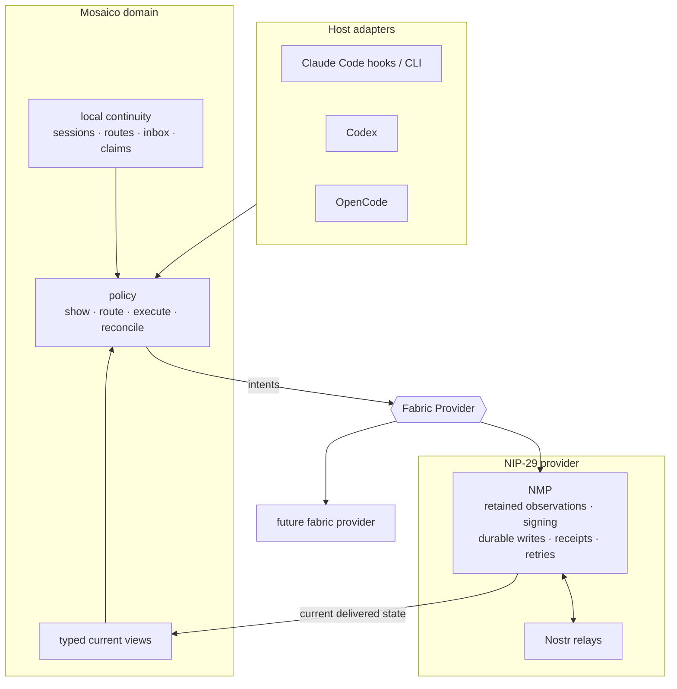
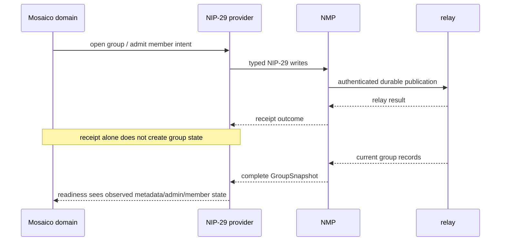

# mosaico — Fabric Architecture

> Mosaico owns product policy and host-local continuity. NMP owns Nostr state
> and transport guarantees. The boundary is enforced by ownership, not by
> module names.

## 1. The swap seam

The former `Codec` seam swapped NIP layouts rather than fabrics. It combined
wire mapping, relay acquisition, admission, state selection, and lifecycle
side effects. A real provider seam separates those concerns:

- the domain expresses product nouns and intents;
- a provider maps those intents to one fabric;
- the fabric substrate owns acquisition and shared-state semantics;
- Mosaico owns local execution and continuity.

```mermaid
flowchart TD
    subgraph HOST["Host adapters"]
        H1["Claude Code hooks / CLI"]
        H2["Codex"]
        H3["OpenCode"]
    end

    subgraph DOMAIN["Mosaico domain"]
        POLICY["policy<br/>show · route · execute · reconcile"]
        LOCAL["local continuity<br/>sessions · routes · inbox · claims"]
        VIEWS["typed current views"]
    end

    SEAM{{"Fabric Provider"}}

    subgraph NIP29["NIP-29 provider"]
        NMP["NMP<br/>retained observations · signing<br/>durable writes · receipts · retries"]
        RELAYS["Nostr relays"]
        NMP <--> RELAYS
    end

    FUTURE["future fabric provider"]

    HOST --> POLICY
    LOCAL --> POLICY
    VIEWS --> POLICY
    POLICY -- intents --> SEAM
    SEAM --> NMP
    SEAM --> FUTURE
    NMP -- current delivered state --> VIEWS
```

Everything above the provider seam speaks product concepts. Everything below it
owns the native protocol. A provider is not a second database or a place to
reimplement the substrate's state machine.

## 2. The ownership rule

**NMP retained observations are the sole authority for relay-derived state.**
For the NIP-29 provider this includes:

- group metadata, topology, admins, and members;
- profiles and statuses;
- events and messages, including recipients and reply relationships;
- reactions;
- replacement selection, source evidence, freshness, and removal.

Mosaico may decode an NMP delivery into a process-local product shape. That
shape has the observation's lifetime and authority: it is updated by delivered
frames, removed by delivered retractions, and cleared when its observation
closes. It cannot outlive NMP by falling back to SQLite.

Mosaico must never:

- copy relay groups, profiles, statuses, events, messages, recipients, or
  reactions into `state.db` as a read cache;
- merge relay records or choose a replaceable winner;
- turn a publish receipt, local intent, route, or prior value into observed
  relay state;
- retain a relay fact after NMP removes it;
- open an independent relay client for a product read or retry a write outside
  NMP.

### 2a. What `state.db` owns

`~/.mosaico/state.db` contains only facts that this daemon must preserve and
that the relay cannot reconstruct as product-local continuity:

| Local class | Current tables | Meaning |
|---|---|---|
| Session and identity authority | `sessions`, `session_coaching`, `session_locators`, `session_signers`, `handle_leases`, `mcp_actor_aliases` | Runtime generations, endpoints, local signers, aliases, and coaching already shown |
| Route and reconciliation policy | `session_channels`, `session_standing`, `workspace_roots`, `channel_resolution_intents` | Local route affinity, join fences, desired standing, filesystem bindings, and unresolved local intents |
| Delivery and execution ledgers | `inbox`, `event_claims`, `native_turn_attempts`, `receipts`, `channel_readiness_attempts` | Locally addressed work, idempotency claims, native execution outcomes, and bounded local attempt evidence |
| Minimal relay correlation | `nmp_event_arrivals`, `message_attachments` | A durable event-id/arrival-sequence fence and the verified directory containing downloaded local files |

`nmp_event_arrivals` stores no event payload. `message_attachments` stores no
attachment tag, URL, relay metadata, or message body. An `inbox` or
`event_claims` row may retain the bounded payload required to execute one
daemon-owned delivery; it is a product-local queue/claim, not a general message
history or relay-state replica.

The local store has one daemon writer. That prevents SQLite corruption, but it
does not turn local rows into relay evidence. In particular:

- `session_channels` is a local route plus signed-time and arrival-sequence
  admission fence, not current relay membership;
- `session_standing` is lifecycle/reconciliation policy, not a copy of the
  NIP-29 roster;
- `inbox` is exact-recipient delivery state, not chat history;
- Mosaico `receipts` explain local product operations and are not NMP publish
  receipts.

## 3. Reads and intents are different contracts

### Reads

A product read joins sources without blurring them:

| Question | Authoritative source |
|---|---|
| Which groups exist, and what are their names and topology? | Current NMP group observation |
| Who is an admin or member? | Current NMP group observation |
| What profile or status is current? | Current NMP row observation |
| Which messages, recipients, replies, or reactions are current? | Current NMP row observation |
| Which runtime can execute locally? | Mosaico session and locator state |
| Which channels should that runtime receive ambiently? | Mosaico route and join-fence state, constrained by current observed fabric facts |
| Which exact local delivery remains pending? | Mosaico inbox/claim ledgers |
| Where are downloaded files on this host? | Mosaico attachment-directory satellite |

DTOs may combine these answers for presentation, but absence must remain
honest. If NMP removes a group, profile, status, event, message, or reaction,
the corresponding product view disappears. A stale local route, inbox row, or
attachment directory cannot resurrect it.

### Intents

Opening a group, changing membership, publishing chat, or publishing status is
an intent. The active provider encodes it and gives it to NMP. NMP owns:

- the exact signing capability and author;
- relay routing and authentication;
- durable custody and retry;
- per-destination receipts and terminal outcomes;
- the observations that may later expose the resulting relay state.

There are two independent milestones:

1. **Publish acceptance or settlement:** NMP accepted responsibility or
   reported a terminal relay result.
2. **Observation:** an active NMP observation delivered the event or current
   row.

The first milestone never substitutes for the second. A successful send does
not insert a local message, recipient edge, inbox row, membership row, profile,
status, or reaction. Product read state and inbound routing begin only from the
observed delivery. This also prevents a locally accepted write from appearing
when the relay never makes it observable.

## 4. Membership, routing, and direct delivery

Membership has two different meanings that must not be collapsed:

| Fact | Owner | Used for |
|---|---|---|
| Current NIP-29 member/admin set | NMP group observation | Relay-visible roster, authorization-aware product reads, readiness confirmation |
| Local session route and join fence | Mosaico | Ambient context eligibility and restart continuity |
| Desired local standing/cleanup | Mosaico | Lifecycle reconciliation and retrying product intent through NMP |

The relay enforces NIP-29 write admission. Mosaico does not repeat that decision
from a stale roster. For another fabric, cryptographic membership or another
native mechanism may supply the same product answer through its provider.

Direct delivery is separate from ambient membership. When an NMP observation
delivers a message explicitly p-tagging a daemon-owned pubkey, Mosaico may park
one durable inbox row for that exact identity, then choose an executor from
local runtime state. A stopped identity may resume; a revoked or unavailable
identity remains pending. Remote p-tags cause no local delivery. Publish
acceptance without observation causes no delivery at all.

Automatic ambient context also applies the local route's two fences:

1. the event's local NMP arrival sequence must be later than the join watermark;
2. the signed event time must be at or after the recorded join time.

The arrival table preserves only this ordering evidence across restart. Event
content remains in NMP.

## 5. Provider responsibilities

A provider bundles four narrow capabilities:

| Capability | Responsibility | Must not |
|---|---|---|
| Lifecycle reactor | Translate product lifecycle intents into native setup, such as NIP-29 group create/lock/member operations | Decide when a workspace opens or invent success before observation |
| Observation adapter | Declare NMP demand and expose delivered current state as typed product views | Persist relay rows, merge sources, select winners, manufacture absence/freshness, or ignore removal |
| Codec | Pure conversion between product intent/data and provider-native envelopes | Open subscriptions, manage retries, or own state |
| Diagnostic edge | Ask NMP for bounded connectivity/readback evidence | Become a second relay plane or a product write path |

For NIP-29, app-owned relay filters are not part of the provider seam. NMP owns
live queries, observation lifetimes, accounts, signing, the durable publish
queue, receipts, retries, and connection repair.

## 6. Representative workflows

### Group creation and readiness

```mermaid
sequenceDiagram
    participant D as Mosaico domain
    participant P as NIP-29 provider
    participant N as NMP
    participant R as relay

    D->>P: open group / admit member intent
    P->>N: typed NIP-29 writes
    N->>R: authenticated durable publication
    R-->>N: relay result
    N-->>P: receipt outcome
    Note over D,P: receipt alone does not create group state
    R-->>N: current group records
    N-->>P: complete GroupSnapshot
    P-->>D: readiness sees observed metadata/admin/member state
```

Readiness may retry bounded product orchestration, but it reads the current NMP
snapshot every time. It never seeds or repairs a Mosaico group cache.

### Chat and local delivery

```mermaid
sequenceDiagram
    participant C as caller
    participant D as Mosaico
    participant N as NMP
    participant R as relay
    participant E as local executor

    C->>D: send message intent
    D->>N: signed-write request
    N->>R: durable publish
    R-->>N: relay result
    N-->>D: terminal receipt
    D-->>C: send result
    Note over D: no message or inbox mutation yet
    R-->>N: observed message
    N-->>D: added current row
    D->>D: record arrival cursor; classify owned p-tags
    D->>D: park exact local inbox work
    D->>E: deliver when an executor is available
```

A later NMP removal removes the message from read/search/reply views. It does
not erase a delivery already parked in the local inbox or downloaded files;
those have separate product-local lifecycles.

### Restart

After restart, Mosaico reopens its session, route, fence, inbox/claim, and local
attachment-directory state. It has no persisted relay view to restore. Groups,
profiles, statuses, events, messages, recipients, and reactions reappear only
as NMP observations deliver them. Until then the honest shared-state answer is
absent or unavailable, never a stale cached value.

## 7. Boundary tests worth preserving

- A removed NMP row immediately disappears from the corresponding public view.
- Closing an observation cannot leave relay-derived state available from
  `state.db`.
- Publish acceptance without an observed event creates no inbox item and no
  routable message.
- Restart preserves a local route fence and attachment directory, while relay
  views remain empty until NMP redelivers them.
- A local standing or route row cannot make an absent pubkey appear in the
  relay roster.
- Every relay write, diagnostic read, and standing observation uses the shared
  NMP host; no parallel relay client exists.
